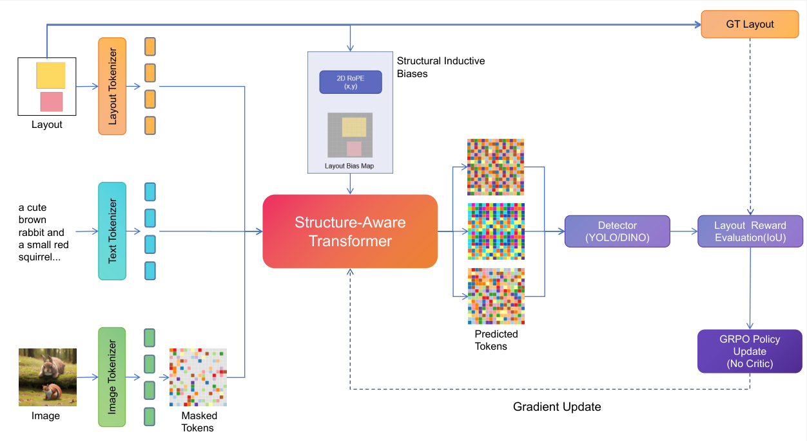
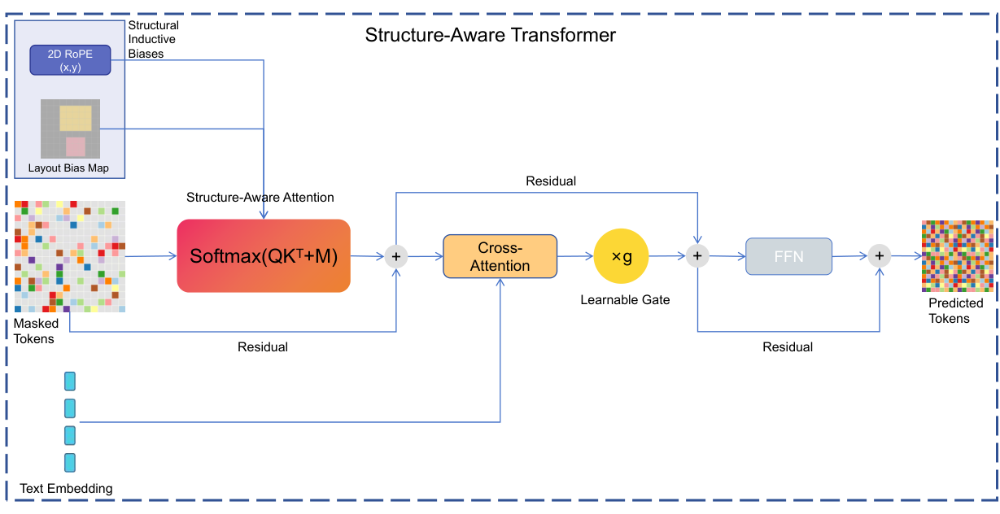

# StructMAR: Structure-Aware Masked Autoregression for Explicit Layout Alignment in Text-to-Image Generation

**(Anonymous ICML Submission)**

## Overview

**StructMAR** is a novel framework that integrates structural inductive biases into a Masked Autoregressive (MAR) pipeline to achieve precise layout alignment in text-to-image generation. Unlike traditional concatenation-based methods, StructMAR explicitly models spatial topology and optimizes layout fidelity directly via reinforcement learning.


> **Figure 1. Overall Architecture of StructMAR.** Our framework integrates structural inductive biases into a Masked Autoregressive (MAR) pipeline. It consists of three primary stages: (1) Structural Tokenization, where 2D RoPE and Layout Tokens provide explicit spatial grounding; (2) Structure-Aware Generation, where the transformer executes layout-guided constraints via attention-logit injection; and (3) Metric-Aligned Optimization, utilizing Group Relative Policy Optimization (GRPO) with detector-based rewards (IoU and confidence) to directly optimize layout fidelity without a critic network.

### Core Contributions

1.  **2D Rotary Embeddings (2D RoPE):** Replaces 1D flattening with explicit X/Y axis encoding to preserve relative spatial awareness.
2.  **Layout-Guided Attention Bias:** Injects hard geometric constraints into the attention mechanism ($A = \text{Softmax}(QK^T + \mathbf{M})$) to force token alignment.
3.  **Group Relative Policy Optimization (GRPO):** A reinforcement learning stage that directly optimizes discrete detection metrics (IoU, Centroid Distance) using a frozen detector as the reward model.


> **Figure 2. Structure-Aware Transformer block used in StructMAR.** We apply 2D RoPE to image-latent queries/keys to restore 2D relative spatial awareness lost by flattening the latent grid. Layout alignment is enforced by injecting a layout-guided bias matrix M into attention logits, yielding Softmax(QK⊤ + M) so that image tokens preferentially attend to their corresponding instance/layout tokens. Text semantics are incorporated via a gated cross-attention branch with learnable gate g, followed by residual connections and an FFN to preserve global coherence and generation quality.

---

## 1. Environment Setup

We recommend using Anaconda to manage the environment.

```bash
# 1. Create environment
conda create -n structmar python=3.9 -y
conda activate structmar

# 2. Install PyTorch (Adjust CUDA version as needed)
pip install torch torchvision --index-url [https://download.pytorch.org/whl/cu118](https://download.pytorch.org/whl/cu118)

# 3. Install dependencies
pip install -r requirements.txt
# Key dependencies: diffusers, transformers, timm, numpy, opencv-python, scipy
```

## 2. Data & Model Preparation

Please organize your project directory as follows:

Plaintext

```
StructMAR/
├── data/
│   └── coco/                 # Standard COCO 2014 dataset
│       ├── train2014/
│       ├── val2014/
│       └── annotations/
├── pretrained_models/
│   ├── vae/
│   │   └── kl16.ckpt         # VAE checkpoint
│   ├── clip-vit-base-patch32/ # Local CLIP model
│   ├── mar_huge.safetensors   # Original MAR-Huge weights (ImageNet pretrained)
│   └── fasterrcnn_resnet50_fpn_v2_coco.pth # For RL Reward
└── output/                   # Training logs and checkpoints
```

- **VAE & MAR Weights:** Download standard VAE (`kl16.ckpt`) and MAR-Huge weights.
- **CLIP:** Download `openai/clip-vit-base-patch32` locally.
- **Reward Model:** Download a pre-trained Faster R-CNN (ResNet50-FPN) for the RL stage.

------

## 3. Training Strategy

We employ a robust **Three-Stage Training Strategy** to ensure stability and performance.

**Note:** We use `mar_huge` as the backbone. Ensure `diffloss_d=12` and `diffloss_w=1536` are set consistent with the MAR-Huge configuration.

### Stage 1: Alignment (Text & Layout Adapter)

**Goal:** Freeze the pretrained ImageNet MAR weights. Train only the newly added Text Adapter (Cross-Attn) and Layout Embeddings.

**Config:** ~20 Epochs.

Bash

```bash
python main_mar.py \
    --output_dir "./output/stage1_align" \
    --coco_root "./data/coco" \
    --coco_split "train2014" \
    --model mar_huge \
    --diffloss_d 12 \
    --diffloss_w 1536 \
    --resume "./pretrained_models/mar_huge.safetensors" \
    --batch_size 64 \
    --epochs 20 \
    --warmup_epochs 5 \
    --train_mode "text_layout" \
    --blr 1e-4 \
    --label_drop_prob 0.1 \
    --save_last_freq 5 \
    --device cuda
```

### Stage 2: Full Supervised Fine-Tuning (SFT)

**Goal:** Unfreeze all parameters. Fine-tune the entire model on COCO to master complex scene generation.

**Config:** ~100 Epochs. Lower learning rate.

**Important:** Resume from Stage 1's `checkpoint-last.pth`.

Bash

```bash
python main_mar.py \
    --output_dir "./output/stage2_sft" \
    --coco_root "./data/coco" \
    --coco_split "train2014" \
    --model mar_huge \
    --diffloss_d 12 \
    --diffloss_w 1536 \
    --resume "./output/stage1_align/checkpoint-last.pth" \
    --batch_size 64 \
    --epochs 100 \
    --warmup_epochs 5 \
    --train_mode "full" \
    --blr 2e-5 \
    --label_drop_prob 0.1 \
    --grad_checkpointing \
    --save_last_freq 5 \
    --device cuda
```

### Stage 3: Reinforcement Learning (GRPO)

**Goal:** Optimize layout alignment metrics (IoU, AP) directly using Group Relative Policy Optimization.

**Config:** ~3-10 Epochs. Requires a frozen detector as a reward model.

**Important:** Resume from Stage 2's `checkpoint-last.pth`.

Bash

```bash
python main_rl.py \
    --output_dir "./output/stage3_rl_grpo" \
    --coco_root "./data/coco" \
    --coco_split "train2014" \
    --model mar_huge \
    --diffloss_d 12 \
    --diffloss_w 1536 \
    --resume "./output/stage2_sft/checkpoint-last.pth" \
    --detector_path "./pretrained_models/fasterrcnn_resnet50_fpn_v2_coco.pth" \
    --epochs 10 \
    --batch_size 4 \
    --group_size 4 \
    --num_iter 256 \
    --rl_step_ratio 1.0 \
    --kl_coef 0.02 \
    --lr 1e-6 \
    --grad_checkpointing \
    --device cuda
```

------

### Qualitative Results

> **Figure 3. Qualitative layout-controlled generations.** StructMAR outputs with the input bounding boxes and tags overlaid (black). The examples illustrate object placement that is generally consistent with the specified layouts across diverse scenes.

> **Figure 4. Successful cases: common objects with clear spatial grounding.** This panel aggregates 16 examples spanning pets and daily objects, indoor scenes, simple product-like objects, and outdoor scenes. Overall, the specified instances are often synthesized within their target boxes, while the surrounding context remains visually plausible across both indoor and outdoor compositions.

> **Figure 5. Successful cases: diverse multi-instance scenes under varied scale and context.** This panel includes 16 examples with broader scene diversity and scale variation, indicating stable layout adherence across heterogeneous backgrounds.

> **Figure 6. Successful cases: attribute- and category-diverse object compositions.** This panel presents 16 object-centric compositions emphasizing category diversity and co-occurrence.

------

## Acknowledgements

This codebase is built upon the implementation of [MAR](https://arxiv.org/abs/2406.11838) (Masked Autoregressive Image Generation). We thank the authors for their open-source contribution.